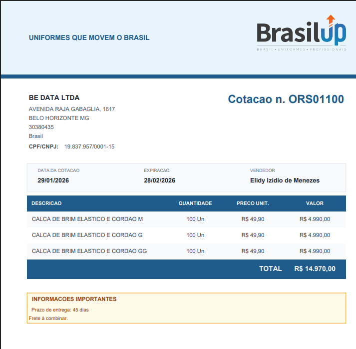

<p align="center">
  
</p>

<h1 align="center">SalesFlow by GEN.IA</h1>

<p align="center">
  <strong>Sistema inteligente de geração de orçamentos</strong>
</p>

<p align="center">
  <a href="https://salesflow.solutions">
    
  </a>
  
  
  
</p>

---

## Sobre o Projeto

**SalesFlow** é uma aplicação web moderna para geração de orçamentos profissionais, desenvolvida para a **Brasil UP Uniformes Profissionais**. O sistema automatiza todo o fluxo de criação de cotações, desde o cadastro de clientes até a geração de PDFs prontos para envio.

### Desenvolvido por

**Be Data** - Automações e Inteligência de Dados
**GEN.IA** - Soluções em Automação

---

## Funcionalidades

### Gestão de Orçamentos
- Criação de orçamentos com numeração sequencial automática (ORS + Mês + Sequência)
- Edição de orçamentos existentes mantendo o mesmo número
- Geração de PDF profissional com layout personalizado
- Busca de orçamentos por número
- Histórico completo de cotações

### Cadastro de Clientes
- **Pessoa Jurídica (PJ)**
  - Consulta automática de CNPJ via BrasilAPI
  - Preenchimento automático de dados da empresa
  - Cadastro de contatos
- **Pessoa Física (PF)**
  - Consulta automática de CEP via ViaCEP
  - Preenchimento automático de endereço

### Catálogo de Produtos
- Organização por categorias
- Preços configuráveis
- Adição de produtos avulsos no orçamento
- Tamanhos padronizados por tipo de produto

### PDF Profissional
- Layout corporativo com logomarca
- Header e footer personalizados
- Tabela de itens formatada
- Campo de observações/informações importantes
- Dados completos do cliente e vendedor

---

## Tech Stack

| Tecnologia | Uso |
|------------|-----|
| **Python 3.10+** | Linguagem principal |
| **Streamlit** | Framework web |
| **FPDF2** | Geração de PDF |
| **Requests** | Consultas API (CNPJ/CEP) |
| **Railway** | Hospedagem |
| **Cloudflare** | DNS e SSL |

---

## Screenshot

<p align="center">
  
</p>

<p align="center">
  <em>Exemplo de orçamento gerado pelo sistema</em>
</p>

---

## Instalação Local

### Pré-requisitos
- Python 3.10 ou superior
- pip (gerenciador de pacotes)

### Passo a passo

```bash
# Clone o repositório
git clone https://github.com/elidyizzy/salesflow-brasilup.git
cd salesflow-brasilup

# Crie o ambiente virtual
python -m venv .venv

# Ative o ambiente virtual
# Windows
.venv\Scripts\activate
# Linux/Mac
source .venv/bin/activate

# Instale as dependências
pip install -r requirements.txt

# Execute a aplicação
streamlit run app.py
```

Acesse: `http://localhost:8501`

---

## Estrutura do Projeto

```
salesflow-brasilup/
│
├── app.py                 # Aplicação principal Streamlit
├── gerar_pdf.py           # Módulo de geração de PDF
├── catalogo.json          # Catálogo de produtos e configurações
├── clientes.json          # Base de clientes (local)
├── orcamentos.json        # Base de orçamentos (local)
│
├── logo.png               # Logomarca Brasil UP (PDF)
├── logo_bedata.png        # Logomarca Be Data (App)
│
├── .streamlit/
│   └── config.toml        # Tema e configurações Streamlit
│
├── Procfile               # Configuração para deploy (Railway)
├── requirements.txt       # Dependências Python
└── README.md
```

---

## Configuração

### Catálogo de Produtos

Edite o arquivo `catalogo.json` para personalizar:

```json
{
  "empresa": {
    "nome": "NOME DA EMPRESA",
    "slogan": "SEU SLOGAN",
    "site": "www.seusite.com.br"
  },
  "vendedores": [
    "Vendedor 1",
    "Vendedor 2"
  ],
  "validade_dias": 30,
  "produtos": [
    {
      "categoria": "Categoria",
      "nome": "NOME DO PRODUTO",
      "preco": 99.90
    }
  ]
}
```

### Tema Visual

O tema pode ser customizado em `.streamlit/config.toml`:

```toml
[theme]
primaryColor = "#E87A2A"           # Laranja (botões)
backgroundColor = "#1C1C1C"        # Cinza chumbo (fundo)
secondaryBackgroundColor = "#2D2D2D"
textColor = "#FAFAFA"
```

---

## Numeração de Orçamentos

O sistema utiliza numeração inteligente:

```
ORS + MM + SEQ
```

- **ORS**: Prefixo fixo
- **MM**: Mês atual (01-12)
- **SEQ**: Sequência iniciando em 100

**Exemplos:**
- Janeiro: `ORS01100`, `ORS01101`, `ORS01102`...
- Fevereiro: `ORS02100`, `ORS02101`...
- Dezembro: `ORS12100`, `ORS12101`...

---

## Deploy

### Railway (Recomendado)

1. Faça fork/clone do repositório
2. Conecte ao Railway via GitHub
3. O `Procfile` já está configurado
4. Configure domínio customizado se desejar

### Streamlit Cloud

1. Acesse [share.streamlit.io](https://share.streamlit.io)
2. Conecte seu repositório GitHub
3. Selecione `app.py` como arquivo principal
4. Deploy!

---

## APIs Utilizadas

| API | Uso | Documentação |
|-----|-----|--------------|
| **BrasilAPI** | Consulta CNPJ | [brasilapi.com.br](https://brasilapi.com.br) |
| **ViaCEP** | Consulta CEP | [viacep.com.br](https://viacep.com.br) |

---

## Roadmap

- [ ] Dashboard com métricas de vendas
- [ ] Integração com Kommo CRM
- [ ] Envio de orçamento por e-mail
- [ ] Assinatura digital
- [ ] Múltiplas empresas/filiais
- [ ] Controle de estoque

---

## Contribuição

Contribuições são bem-vindas! Sinta-se à vontade para abrir issues ou pull requests.

---

## Licença

Este projeto está sob a licença MIT. Veja o arquivo [LICENSE](LICENSE) para mais detalhes.

---

<p align="center">
  <strong>Desenvolvido com por Be Data</strong>
</p>

<p align="center">
  <a href="https://bedata.com.br">Be Data</a> •
  <a href="https://salesflow.solutions">SalesFlow</a>
</p>
